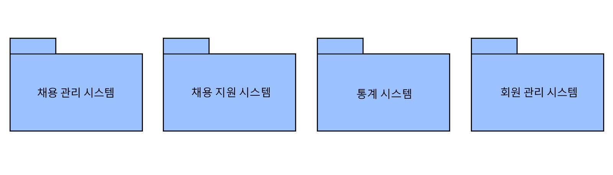
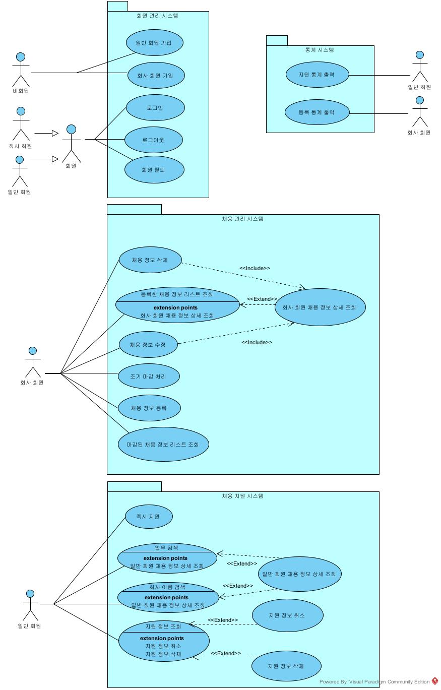

# 소프트웨어 공학 14조 과제2

### 0) 수행 내용

- (각 인원 별 담당 Usecase는 Requirement List에 기술되어 있음)
- 백준영 - 통계 시스템 2 + 회원 관리 시스템 4
    - 등록 통계 출력, 지원 통계 출력
    - 회원탈퇴, 회원가입, 로그인, 로그아웃
- 한솔빈 - 채용관리 5 (표에서 위에서부터 다섯개)
    - 채용 정보 등록, 등록한 채용 정보 리스트 조회, 회사회원 채용 정보 상세조회, 채용 정보 수정, 채용 정보 삭제
- 채승희 - 채용지원 5 (표에서 밑에서부터 5개)
    - 채용 정보 검색, 업무 검색, 회사 이름 검색, 마감일 정렬, 일반 회원 채용 정보 상세 조회
- 정동민 - 채용관리 2 + 채용지원 4
    - 조기 마감 처리, 마감된 채용 정보 리스트 조회
    - 지원 정보 조회, 지원 정보 취소, 지원 정보 삭제

### 1) Initial Architecture

### 2) Requirement List

- 채용 관리 시스템 - 7개
- 채용 지원 시스템 - 9개
- 통계 시스템 - 2개
- 회원 관리 시스템 - 4개

| 담당 | requirement | Use Case | 시스템 |
| --- | --- | --- | --- |
| 백준영 | 채용 정보 리스트에서 선택한 채용 정보에 즉시 지원하기 위해 | 즉시 지원 | 채용 지원 시스템 |
| 백준영 | 특정 채용정보 상세 보기에서 선택된 항목과 유사한 채용 정보를 추천하기 위해 | 유사 채용 정보 추천 |  |
| 백준영 | 채용 지원 후 원할 시 기차표 예약을 위해 | 기차 예약 |  |
| 채승희 | 회사 회원은 본인의 직책, 업무, 인원 수, 신청 마감일 등의 채용 정보를 등록할 수 있다.  | 채용 정보 등록 | 채용 관리 시스템 |
| 채승희 | 회사 회원은 자신이 등록한 채용 정보 리스트를 조회할 수 있다.  | 등록한 채용 정보 리스트 조회 | 채용 관리 시스템 |
| 채승희 | 회사 회원은 자신이 등록한 채용 정보를 상세 조회할 수 있다.  | 회사회원 채용 정보 상세 조회 | 채용 관리 시스템 |
| 채승희 | 회사 회원은 자신이 등록한 채용 정보를 수정할 수 있다.  | 채용 정보 수정 | 채용 관리 시스템 |
| 채승희 | 회사 회원은 자신이 등록한 채용 정보를 삭제할 수 있다.  | 채용 정보 삭제  | 채용 관리 시스템 |
| 채승희 | 회사 회원은 자신이 등록한 채용 정보 중에서 원하는 지원자 수에 도달한 경우 채용을 조기 마감 처리할 수 있다.  | 조기 마감 처리 | 채용 관리 시스템 |
| 채승희 | 회사 회원은 마감일이 지났거나 마감 처리된 채용 정보 내역을 조회할 수 있다.  | 마감된 채용 정보 리스트 조회 | 채용 관리 시스템 |
| 한솔빈 | 회사 회원이 현재까지 등록한 모든 채용 정보에 대해 신청 마감시간 기준으로 연도별, 직책별 및 업무별 지원자 수를 출력한다. | 등록 통계 출력 | 통계 시스템 |
| 한솔빈 | 일반 회원에게 본인이 지원한 정보에 대해 마감시간 기준으로 월별, 직책별, 업무별 지원 횟수를 출력한다. | 지원 통계 출력 | 통계 시스템 |
| 한솔빈 | 매월 말일에 각 회원에게 해당 통계 정보를 이메일로 발송한다. | 통계 전송 |  |
| 한솔빈 | 일반 회원은 자신의 지원 정보(회사이름, 직책, 업무, 인원수, 신청 마감일)를 조회할 수 있다. 이때 회사이름의 오름차순으로 정렬해서 출력한다. | 지원 정보 조회 | 채용 지원 시스템 |
| 한솔빈 | 마감일이 지나지 않은 지원 정보를 선택해서 지원을 취소할 수 있으며 취소된 채용 정보는 해당 회원의 이메일로 통보되며 연계된 기차 예매는 자동으로 취소 요청된다. | 지원 정보 취소 | 채용 지원 시스템 |
| 한솔빈 | 마감 시간이 지난 지원 정보는 임의로 삭제가 가능하며 취소된 지원 정보는 6개월이 지나면 자동으로 삭제된다. | 지원 정보 삭제 | 채용 지원 시스템 |
| 정동민 | 일반회원 및 회사회원은 회원자격을 상실한다. 단, 회사회원은 채용 정보 등록 건수가 없어야 탈퇴 가능하다. | 회원탈퇴 | 회원 관리 시스템 |
| 정동민 | 사용자는 시스템을 사용하기 위해 회원으로 가입할 수 있다. | 회원가입 | 회원 관리 시스템 |
| 정동민 | 시스템을 이용하기 위해 회원들은 로그인할 수 있다. | 로그인 | 회원 관리 시스템 |
| 정동민 | 시스템 사용을 중지하기 위해 회원들은 로그아웃 할 수 있다. | 로그아웃 | 회원 관리 시스템 |
| 정동민 | 일반 회원은 자신이 원하는 채용 정보를 검색할 수 있다. | 채용 정보 검색 | 채용 지원 시스템 |
| 정동민 | 일반 회원은 업무 위주로 채용 정보를 검색 할 수 있다. | 업무 검색 | 채용 지원 시스템 |
| 정동민 | 일반 회원은 회사 이름 위주로 채용 정보를 검색 할 수 있다. | 회사 이름 검색 | 채용 지원 시스템 |
| 정동민 | 일반 회원은 검색 된 채용 정보들을 마감일 오름차순으로 변경 할 수 있다. | 마감일 정렬 | 채용 지원 시스템 |
|  | 일반 회원은 자신이 검색한 채용 정보를 상세 조회할 수 있다. | 일반 회원 채용 정보 상세 조회 | 채용 지원 시스템 |

### 3) Use Case Diagrams

<백준영: 다이어그램 갱신, 각자 한번씩 오류 없나 검토 바람>

### 4) Actor Descriptions

| Actor | Descriptions |
| --- | --- |
| 회원 | 일반 회원과 회사 회원으로서 시스템을 이용하는 user이다. |
| 일반 회원 | 사이트를 이용해 채용 정보를 검색, 열람하고 채용 즉시 지원 및 지원 철회를 할 수 있음 |
| 회사 회원 | 사이트를 이용해 채용 정보를 등록 및 관리하고 채용 정보 마감 관리를 할 수 있음  |

### 5) Use Case Descriptions (step by step breakdown)

- 채용 정보 등록
    
    
    | Actor Action | System Response |
    | --- | --- |
    | 1. 등록 버튼을 누른다. | 2. 등록 양식을 보여준다. |
    | 3. 업무, 인원 수, 신청 마감일 등의 정보를 입력 후 저장 버튼을 누른다. | 4. '등록되었습니다.’ 문구를 보여준다.  |
- 채용 정보 리스트 조회
    
    
    | Actor Action | System Response |
    | --- | --- |
    | 1. 채용 정보 열람하기 버튼을 누른다.  | 2. 회원이 등록한 채용 정보 리스트를 보여준다.  |
- 채용 정보 상세 조회
    
    
    | Actor Action | System Response |
    | --- | --- |
    | 1. 채용 정보 열람하기 버튼을 누른다.  | 2. 회원이 등록한 채용 정보 리스트를 보여준다.  |
    | 3. 원하는 채용 정보를  선택한다.  | 4. 화면에 특정 채용 정보를 보여준다.  |
- 채용 정보 수정
    
    
    | Actor Action | System Response |
    | --- | --- |
    | 1. 채용 정보 열람하기 버튼을 누른다. | 2. 회원이 등록한 채용 정보 리스트를 보여준다. |
    | 3. 원하는 채용 정보를 선택한다. | 4. 화면에 특정 채용 정보를 보여준다. |
    | 5. 수정하기 버튼을 누른다.  | 6. 수정 양식을 보여준다. |
    | 7. 수정 사항을 입력하고 저장하기 버튼을 누른다. | 8. ‘수정이 완료되었습니다.’ 문구를 보여준다.  |
- 채용 정보 삭제
    
    
    | Actor Action | System Response |
    | --- | --- |
    | 1. 채용 정보 열람하기 버튼을 누른다.  | 2. 회원이 등록한 채용 정보 리스트를 보여준다.  |
    | 3. 원하는 채용 정보를  선택한다.  | 4. 화면에 특정 채용 정보를 보여준다.  |
    | 5. 삭제하기 버튼을 누른다. | 6. ‘삭제가 완료되었습니다.’ 문구를 보여준다.  |
- 채용 마감 처리
    
    
    | Actor Action | System Response |
    | --- | --- |
    | 1. 채용 정보 열람하기 버튼을 누른다.  | 2. 회원이 등록한 채용 정보 리스트를 보여준다.  |
    | 3. 원하는 지원자 수에 도달한  채용 정보를  선택한다.  | 4. 화면에 특정 채용 정보를 보여준다.  |
    | 5. 마감 버튼을 누른다. | 6. ‘마감 처리가 완료되었습니다.’ 문구를 보여준다.  |
- 채용 마감 내역 조회
    
    
    | Actor Action | System Response |
    | --- | --- |
    | 1. 마감된 채용 정보 열람하기 버튼을 누른다.  | 2. 마감일이 지났거나 마감 처리된 채용 정보 내역을 마감일 오름차순으로 보여준다. 이때, 각 채용 정보에 대해 업무, 신청 마감일 정보를 출력한다.  |
- 지원 정보 조회
    
    
    | Actor Action | System Response |
    | --- | --- |
    | 1. <채워주시기 바람!> | 2. 사용자의 지원정보를 오름차순으로 리스팅한다. |
    
    After step 2, 일반회원은 지원정보를 취소할 수 있음.
    After step 2, 일반회원은 지원정보를 삭제할 수 있음.
    
- 지원 정보 취소
    
    
    | Actor Action | System Response |
    | --- | --- |
    | 1. <채워주시기 바람!> | 2. ‘지원정보를 취소하시겠습니까?’를 출력한다.  |
    | 3. 확인하기 버튼을 누른다. | 4. ‘지원정보가 취소되었습니다.’를 출력한다.  |
- 지원 정보 삭제
    
    
    | Actor Action | System Response |
    | --- | --- |
    | 1. <채워주시기 바람!> | 2. ‘지원정보를 삭제하시겠습니까?’를 출력한다.  |
    | 3. 확인하기 버튼을 누른다. | 4. ‘지원정보가 삭제되었습니다.’를 출력한다.  |
- 등록 통계 출력
    
    
    | Actor Action | System Response |
    | --- | --- |
    | 1. 회사 회원이 홈페이지에 접속한다. | 2. 마감시간을 기준으로 회사 회원에게 등록 통계정보를 출력한다. |
- 지원 통계 출력
    
    
    | Actor Action | System Response |
    | --- | --- |
    | 1. 일반 회원이 홈페이지에 접속한다. | 2. 마감시간을 기준으로 일반 회원에게 지원 통계정보를 출력한다. |
- 즉시 지원
    
    
    | Actor Action | System Response |
    | --- | --- |
    | 1. 채용 정보 리스트에서 채용 정보를 클릭 | 2. ‘지원 성공’ 을 출력한다. |
- 회원탈퇴
    
    
    | Actor Action | System Response |
    | --- | --- |
    | 1. 회원 정보를 입력한다. | 2. ‘회원 탈퇴 완료’를 출력한다. |
- 회원가입
    
    
    | Actor Action | System Response |
    | --- | --- |
    | 1. 회원가입 정보 입력한다. | 2. ‘회원 등록 완료’를 출력한다. |
- 로그인
    
    
    | Actor Action | System Response |
    | --- | --- |
    | 1. ‘로그인 페이지’ 에서 회원 정보를 입력 후 로그인 버튼을 클릭한다. | 2. ‘홈페이지’를 출력한다. |
- 로그아웃
    
    
    | Actor Action | System Response |
    | --- | --- |
    | 1. 사용자가 로그아웃 버튼을 클릭한다. | 2. ‘로그인 페이지’를 출력한다. |
- 채용 정보 검색
    
    
    | Actor Action | System Response |
    | --- | --- |
    | 1. 일반 회원이 원하는 채용 정보를 검색한다. | 2. 채용 정보 리스트를 보여준다. |
- 업무 검색
    
    
    | Actor Action | System Response |
    | --- | --- |
    | 1. 업무 검색을 클릭하고 채용 정보를 검색한다. | 2. 검색한 업무와 관련된 채용 정보를 보여준다. |
- 회사 이름 검색
    
    
    | Actor Action | System Response |
    | --- | --- |
    | 1. 회사 이름 검색을 클릭하고 채용 정보를 검색한다. | 2. 회사 이름과 관련된 채용 정보를 보여준다. |
- 마감일 정렬
    
    
    | Actor Action | System Response |
    | --- | --- |
    | 1. 마감일 정렬을 클릭한다. | 2. 마감일 오름차순으로 채용 정보를 보여준다. |